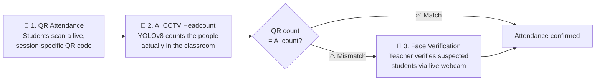
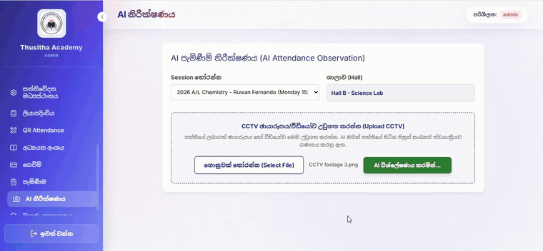
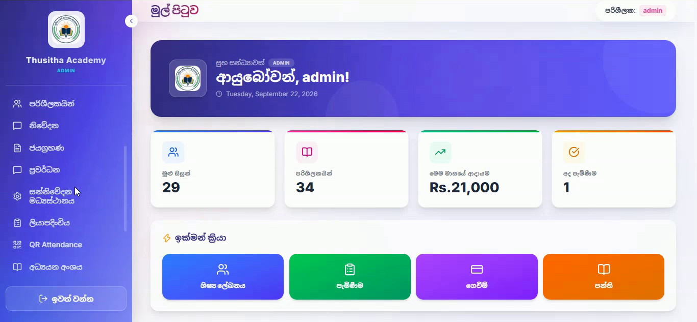
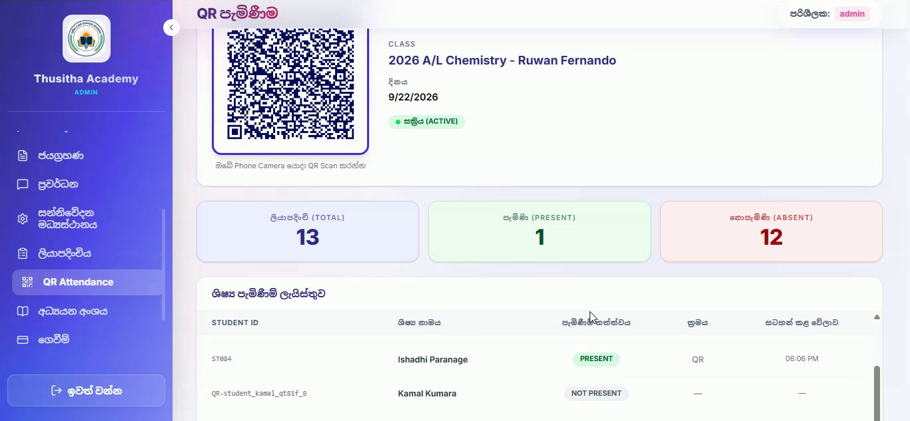
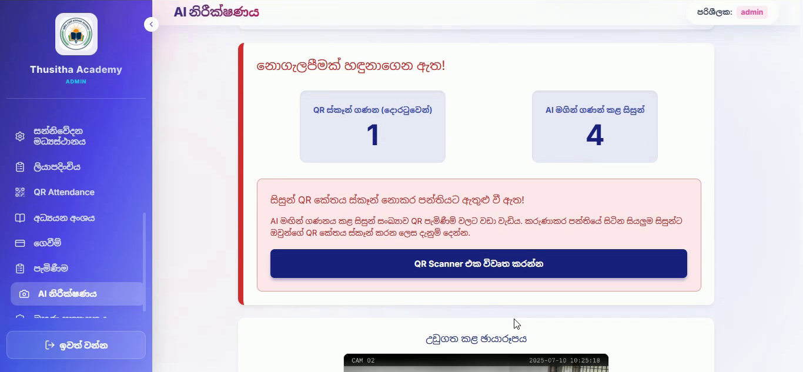
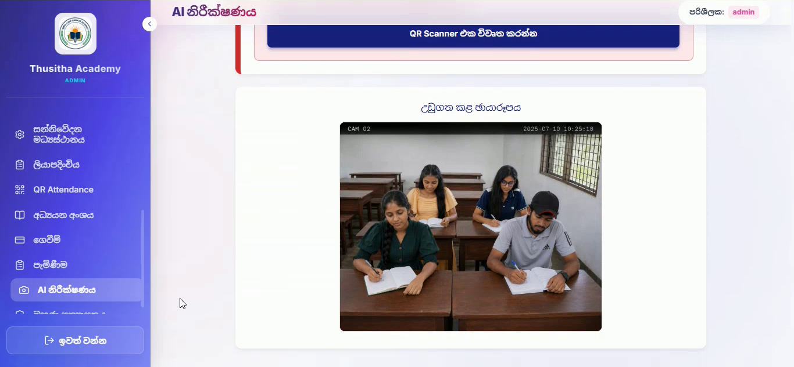
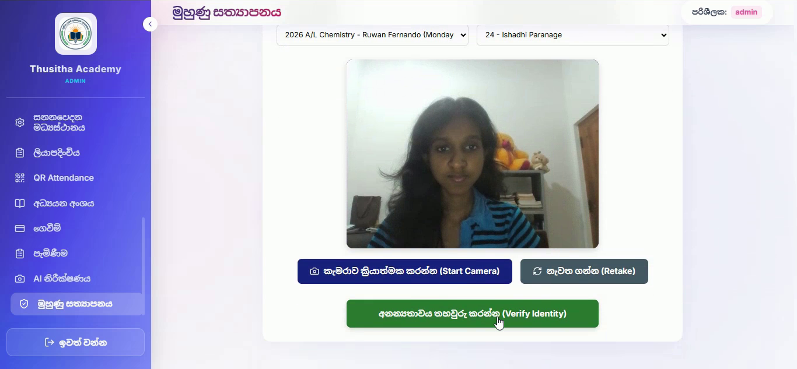
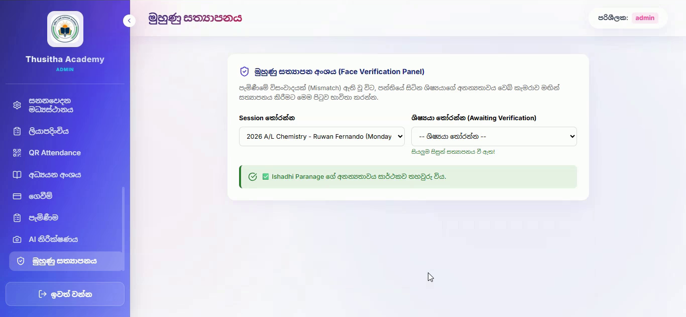
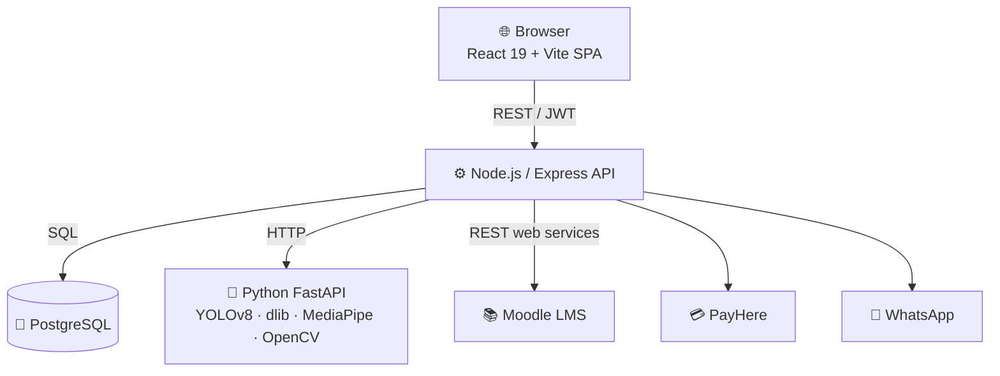

<div align="center">

# 🎓 Smart Class Management System (SCMS)

**An AI-powered class management platform for a real tutoring institute in Sri Lanka — with 3-layer, proxy-proof attendance.**

[](https://scms-frontend-lac.vercel.app)


</div>

---

## 📖 About

**SCMS** was built for **Thusitha Academy**, a tutoring institute in Sri Lanka. It replaces paper attendance registers, manual fee tracking and phone calls to parents with one web platform for **admins, teachers, counter staff, students and parents**.

Tutoring classes often have 100+ students, and "proxy" attendance (a friend scanning or signing for an absent student) is a real problem. So we made attendance the heart of the system and **verified it with AI**.

> 🧑‍💻 Group project: 3rd year, 2nd semester (3.2) · Industrial Information Technology · Uva Wellassa University of Sri Lanka

---

## ✨ Our novelty: 3-layer AI-verified attendance



1. **QR attendance:** each class session gets a time-limited QR code. Students scan it with their phone camera.
2. **AI CCTV headcount:** a CCTV image or video of the classroom goes to our Python AI service. **YOLOv8** detects every person, while a dual-engine face detector (**dlib HOG + MediaPipe**, merged by IoU) finds each face — matched across 15 sampled video frames so a blink or head turn doesn't cause a false result.
3. **Mismatch → face verification:** if the number of QR scans doesn't match the number of people the AI counted, the system raises an alert. The teacher can then verify students one by one with **live face recognition** (128-D dlib face encodings, Euclidean distance < 0.45, matched against each student's enrolled face profile).

**Result:** no more proxy attendance, and teachers can trust the numbers.

<div align="center">
  
  <br/><sub>AI detects a mismatch (1 QR scan vs 4 people in class), then face verification confirms the student</sub>
</div>

📄 Technical deep-dive: [`ai_implementation_explanation.md`](ai_implementation_explanation.md)

---

## 🧩 Features

| Area | What it does |
|---|---|
| 🧑‍🎓 **Students & Teachers** | Registration, profiles, QR ID cards, face-encoding enrolment, class enrolment |
| ✅ **Attendance** | QR attendance, AI CCTV headcount, mismatch alerts, face verification, validation reports |
| 💳 **Payments** | Online payments via **PayHere**, bank-receipt upload & approval, fee reminders |
| 📚 **Learning (Moodle LMS)** | Course materials, enrolment sync and single sign-on with Moodle |
| 📝 **Exams & Timetables** | Exam management, results, class timetables, study area with countdowns |
| 👨‍👩‍👧 **Parent Portal** | Parents follow their child's attendance, payments and results |
| 🔔 **Notifications** | Automated WhatsApp alerts to parents (attendance, payments, reminders) with message logs |
| 📣 **Promotions & Achievements** | Institute promotions and student achievements on the public landing page |
| 🔐 **Security** | JWT auth, role-based access (Admin, Teacher, Counter Person, Student, Parent), login lockout, OTP, audit logs |

The UI is in **Sinhala and English**, made for the institute's staff and students.

---

## 📸 Screenshots

| Admin Dashboard | QR Attendance |
|:---:|:---:|
|  |  |
| **AI Mismatch Alert** | **CCTV Analysis** |
|  |  |
| **Face Verification** | **Identity Verified** |
|  |  |

---

## 🏗️ Architecture



| Layer | Technology |
|---|---|
| **Frontend** | React 19, Vite, Tailwind CSS 4, Axios |
| **Backend** | Node.js, Express, JWT, raw parameterised SQL (`pg`) |
| **AI service** | Python, FastAPI, YOLOv8 (Ultralytics), dlib `face_recognition`, MediaPipe, OpenCV |
| **Database** | PostgreSQL |
| **Integrations** | Moodle LMS, PayHere, WhatsApp (Baileys) |
| **Testing** | Jest + Supertest (unit, system and use-case tests) |
| **Deployment** | Vercel (frontend) · Render + Docker (backend + AI) · Neon (PostgreSQL) |

---

## 🚀 Getting started

**You'll need:** Node.js 22/24, Python 3.12, PostgreSQL 16, and (on Windows) Visual Studio Build Tools for `dlib`.

```bash
git clone https://github.com/Ishadhisl/Smart-Class-Management-System-IIT-Group-3.git
cd Smart-Class-Management-System-IIT-Group-3

# Backend (also auto-starts the Python AI service)
cd thusitha-backend
cp .env.example .env        # then fill in DB credentials, JWT secret, etc.
npm install
node import_database.js     # creates the database + sample data
npm start

# Frontend (in a second terminal)
cd thusitha-frontend
npm install
npm run dev                 # open https://localhost:5173
```

📘 Full step-by-step guide (HTTPS certificates, migrations, Moodle, troubleshooting): **[`docs/SETUP.md`](docs/SETUP.md)**

### More documentation
- 🤖 [AI attendance subsystem](ai_implementation_explanation.md)
- 🗄️ [Database](DATABASE.md)
- 🔐 [Security measures](SECURITY.md)
- 📚 [Moodle setup](moodle_setup.md)
- ☁️ [Deployment](deploy/DEPLOY.md)

---

## 👥 Team

| Member | GitHub |
|---|---|
| Ishadhi Paranage | [@Ishadhisl](https://github.com/Ishadhisl) |
| Lasitha Priyasad | [@Priyasad010](https://github.com/Priyasad010) |
| Parami Pramodya | [@ParamiPramodya](https://github.com/ParamiPramodya) |
| Dilini Kavushalya | [@diliniCoder](https://github.com/diliniCoder) |

---

<div align="center">
  <sub>Built with ❤️ for Thusitha Academy by IIT Group 3</sub>
</div>
