# Smart Class Management System (SCMS) - Comprehensive ER Diagram & Database Documentation

> **Database Engine:** PostgreSQL (`thusithaedu_db`)  
> **Total Entities:** 31 Tables  
> **Architecture:** Role-Based Multi-Tier Smart Education Management with AI Attendance & Safety Monitoring

---

## 1. High-Level Architecture & Functional Modules

The database schema is organized into **10 core functional domains**:

1. **User & Identity Management:** `Users`, `Teachers`, `Students`, `Parents`, `Counter_Person`
2. **Academic Structure & Scheduling:** `Subjects`, `Courses`, `Halls`, `Class_Schedules`, `Course_Enrollments`
3. **Smart Attendance & AI Verification (Novelty):** `Attendance_Sessions`, `Student_Attendance_Logs`, `Attendance_Master`, `Camera_Zones`, `Suspicious_Attendance_Logs`
4. **Hall Safety & Crowd Congestion (Novelty):** `Hall_Congestion_Tracker`, `Hall_Congestion_Logs`
5. **Smart Study Area Allocation (Novelty):** `Study_Seats`, `Study_Area_Bookings`
6. **Payment & Fee Management:** `Payments`
7. **Examinations & Learning Materials:** `Exams`, `Exam_Results`, `Learning_Materials`
8. **Communication & Messaging:** `SMS_Logs`, `Contact_Messages`
9. **Public Website & Student Engagement:** `Promotions`, `Announcements`, `Student_Achievements`, `PendingRegistrations`
10. **System Administration & Audit:** `System_Settings`, `AuditLogs`

---

## 2. Complete Mermaid ER Diagram

Copy-paste this directly into any Markdown viewer (GitHub, VS Code Markdown Preview, Notion) or [Mermaid Live Editor](https://mermaid.live).

```mermaid
erDiagram
    %% ==========================================
    %% 1. USER & IDENTITY MANAGEMENT
    %% ==========================================
    USERS {
        int user_id PK
        string username
        string password_hash
        string role
        string email
        timestamp created_at
    }

    STUDENTS {
        int student_id PK
        int user_id FK
        int parent_id FK
        string student_name
        string school
        string grade
        string address
        string qr_code_key
        text profile_photo_path
        jsonb face_encoding
        string moodle_user_id
        timestamp created_at
    }

    PARENTS {
        int parent_id PK
        int user_id FK
        string parent_name
        string parent_phone
        text address
    }

    TEACHERS {
        int teacher_id PK
        int user_id FK
        string teacher_name
        string phone
        string email
        string specialization
        text qualifications
        text bio
        text profile_photo_path
    }

    COUNTER_PERSON {
        int counter_person_id PK
        int user_id FK
        string staff_name
        string phone
        string email
        date joined_date
        string status
    }

    %% ==========================================
    %% 2. ACADEMIC STRUCTURE
    %% ==========================================
    SUBJECTS {
        int subject_id PK
        string subject_name
        text description
    }

    COURSES {
        int course_id PK
        int subject_id FK
        int teacher_id FK
        string course_name
        decimal monthly_fee
        boolean is_professional_course
    }

    HALLS {
        int hall_id PK
        string hall_name
        int capacity
    }

    CLASS_SCHEDULES {
        int schedule_id PK
        int course_id FK
        int hall_id FK
        string day_of_week
        time start_time
        time end_time
    }

    COURSE_ENROLLMENTS {
        int enrollment_id PK
        int student_id FK
        int course_id FK
        string enrollment_status
        timestamp enrolled_at
    }

    %% ==========================================
    %% 3. SMART ATTENDANCE & AI VERIFICATION
    %% ==========================================
    ATTENDANCE_SESSIONS {
        int session_id PK
        int schedule_id FK
        int course_id FK
        date session_date
        string qr_token
        timestamp expires_at
        string status
        int created_by FK
        timestamp created_at
        timestamp updated_at
    }

    STUDENT_ATTENDANCE_LOGS {
        int log_id PK
        int student_id FK
        int course_id FK
        int session_id FK
        string attendance_status
        string method
        timestamp scanned_at
    }

    ATTENDANCE_MASTER {
        int session_id PK,FK
        int qr_count
        int ai_headcount
        jsonb zone_details
        boolean mismatch_detected
        jsonb verification_data
        timestamp validated_at
    }

    CAMERA_ZONES {
        int zone_id PK
        int hall_id FK
        string zone_name
        text camera_url
        decimal calibration_factor
    }

    SUSPICIOUS_ATTENDANCE_LOGS {
        int log_id PK
        int session_id FK
        int qr_count
        int ai_headcount
        jsonb zone_details
        jsonb unverified_student_ids
        jsonb image_paths
        string status
        text resolution_comment
        timestamp detected_at
    }

    %% ==========================================
    %% 4. HALL SAFETY & CROWD CONGESTION
    %% ==========================================
    HALL_CONGESTION_TRACKER {
        int hall_id PK,FK
        timestamp first_detected_at
        boolean sms_sent
        int active_log_id
    }

    HALL_CONGESTION_LOGS {
        int log_id PK
        int hall_id FK
        int peak_count
        int capacity
        timestamp started_at
        timestamp ended_at
        int duration_minutes
    }

    %% ==========================================
    %% 5. STUDY AREA ALLOCATION
    %% ==========================================
    STUDY_SEATS {
        int seat_id PK
        string seat_status
    }

    STUDY_AREA_BOOKINGS {
        int booking_id PK
        int student_id FK
        int seat_id FK
        timestamp expected_arrival_time
        timestamp actual_arrival_time
        timestamp actual_end_time
        timestamp expiry_time
        string booking_status
    }

    %% ==========================================
    %% 6. PAYMENTS & FEES
    %% ==========================================
    PAYMENTS {
        int payment_id PK
        int student_id FK
        int course_id FK
        int issued_by FK
        decimal amount_paid
        string payment_method
        string for_month
        string receipt_number
        string payment_status
        timestamp payment_date
        string confirmation_url
        text verification_comments
    }

    %% ==========================================
    %% 7. EXAMS & LEARNING MATERIALS
    %% ==========================================
    EXAMS {
        int exam_id PK
        int course_id FK
        string exam_name
        date exam_date
        int total_marks
        int pass_percentage
    }

    EXAM_RESULTS {
        int student_id PK,FK
        int exam_id PK,FK
        decimal marks
    }

    LEARNING_MATERIALS {
        int material_id PK
        int course_id FK
        int teacher_id FK
        string material_title
        string material_type
        text uploaded_file
        timestamp uploaded_at
    }

    %% ==========================================
    %% 8. COMMUNICATIONS & INQUIRIES
    %% ==========================================
    SMS_LOGS {
        int log_id PK
        int parent_id FK
        string parent_phone
        string sms_type
        text message_body
        string status
        timestamp sent_at
    }

    CONTACT_MESSAGES {
        int message_id PK
        string sender_name
        string sender_email
        string sender_phone
        string subject
        text message_text
        string status
        boolean is_read
        boolean is_important
        timestamp submitted_at
    }

    PENDINGREGISTRATIONS {
        int id PK
        int course_interest FK
        string name
        string school
        string grade
        string phone
        string email
        string status
    }

    %% ==========================================
    %% 9. PUBLIC WEBSITE & ENGAGEMENT
    %% ==========================================
    PROMOTIONS {
        int promo_id PK
        string title
        string content_type
        text description
        text image_url
        timestamp created_at
    }

    ANNOUNCEMENTS {
        int announcement_id PK
        int created_by FK
        string title
        text body
        boolean is_active
        timestamp posted_at
    }

    STUDENT_ACHIEVEMENTS {
        int achievement_id PK
        int student_id FK
        string title
        text description
        int island_rank
        int achieved_year
        timestamp created_at
    }

    %% ==========================================
    %% 10. SYSTEM CONFIGURATION & AUDITING
    %% ==========================================
    SYSTEM_SETTINGS {
        string setting_key PK
        text setting_value
        text description
        timestamp updated_at
    }

    AUDITLOGS {
        int log_id PK
        int performed_by FK
        string role
        string action_type
        string target_table
        int target_id
        text details
        timestamp timestamp
    }

    %% ==========================================
    %% RELATIONSHIPS & CARDINALITIES
    %% ==========================================
    USERS ||--o| STUDENTS : "has profile"
    USERS ||--o| PARENTS : "has profile"
    USERS ||--o| TEACHERS : "has profile"
    USERS ||--o| COUNTER_PERSON : "has profile"
    PARENTS ||--o{ STUDENTS : "parent of"

    SUBJECTS ||--o{ COURSES : "categorizes"
    TEACHERS ||--o{ COURSES : "instructs"
    COURSES ||--o{ CLASS_SCHEDULES : "has"
    HALLS ||--o{ CLASS_SCHEDULES : "hosts"
    STUDENTS ||--o{ COURSE_ENROLLMENTS : "registers"
    COURSES ||--o{ COURSE_ENROLLMENTS : "contains"

    CLASS_SCHEDULES ||--o{ ATTENDANCE_SESSIONS : "conducted for"
    COURSES ||--o{ ATTENDANCE_SESSIONS : "session of"
    USERS ||--o{ ATTENDANCE_SESSIONS : "generated by"
    ATTENDANCE_SESSIONS ||--o{ STUDENT_ATTENDANCE_LOGS : "logs"
    STUDENTS ||--o{ STUDENT_ATTENDANCE_LOGS : "marks"
    COURSES ||--o{ STUDENT_ATTENDANCE_LOGS : "for course"
    CLASS_SCHEDULES ||--o| ATTENDANCE_MASTER : "master record"
    CLASS_SCHEDULES ||--o{ SUSPICIOUS_ATTENDANCE_LOGS : "flags"

    HALLS ||--o{ CAMERA_ZONES : "monitored by"
    HALLS ||--o| HALL_CONGESTION_TRACKER : "monitored by"
    HALLS ||--o{ HALL_CONGESTION_LOGS : "logs incidents"

    STUDY_SEATS ||--o{ STUDY_AREA_BOOKINGS : "allocated to"
    STUDENTS ||--o{ STUDY_AREA_BOOKINGS : "reserves"

    STUDENTS ||--o{ PAYMENTS : "pays"
    COURSES ||--o{ PAYMENTS : "fee for"
    USERS ||--o{ PAYMENTS : "issued by"

    COURSES ||--o{ EXAMS : "holds"
    EXAMS ||--o{ EXAM_RESULTS : "grades"
    STUDENTS ||--o{ EXAM_RESULTS : "achieves"

    COURSES ||--o{ LEARNING_MATERIALS : "includes"
    TEACHERS ||--o{ LEARNING_MATERIALS : "uploads"

    PARENTS ||--o{ SMS_LOGS : "receives"
    COURSES ||--o{ PENDINGREGISTRATIONS : "interested in"

    USERS ||--o{ ANNOUNCEMENTS : "publishes"
    STUDENTS ||--o{ STUDENT_ACHIEVEMENTS : "attains"
    USERS ||--o{ AUDITLOGS : "logs actions"
```



---

## 3. How to View and Edit the Diagram

1. **Option A: dbdiagram.io (Interactive UI, Draggable, Auto-layout)**
   - Open [https://dbdiagram.io/d](https://dbdiagram.io/d)
   - Open file `database/SCMS_ER_Diagram.dbml`
   - Paste the DBML code into the left pane.
   - You will instantly get a state-of-the-art interactive ER diagram!

2. **Option B: Mermaid Live Editor**
   - Open [https://mermaid.live](https://mermaid.live)
   - Copy the Mermaid code above and paste it in the editor.
   - Export as PNG, SVG, or PDF.

3. **Option C: PlantUML (Enterprise Standard)**
   - Open [https://www.planttext.com](https://www.planttext.com)
   - Open file `database/SCMS_ER_Diagram.puml`
   - Paste the code to generate high-resolution PNG / SVG.

---

## 4. Prompts for AI & Diagramming Generators

### Master Prompt for AI (ChatGPT / Claude / Gemini / Eraser.io)

```text
Act as a Senior Database Architect. Generate a complete, highly professional, production-ready Entity-Relationship (ER) diagram for the "Smart Class Management System (SCMS)" built on PostgreSQL.

System Overview & Key Domains:
1. Core Identity & RBAC:
   - Users (user_id PK, username UK, password_hash, role [Admin, Teacher, Counter Person, Parent, Student], email, created_at)
   - Students (student_id PK, user_id FK, parent_id FK, student_name, school, grade, address, qr_code_key UK, profile_photo_path, face_encoding JSONB, moodle_user_id, created_at)
   - Parents (parent_id PK, user_id FK, parent_name, parent_phone UK, address)
   - Teachers (teacher_id PK, user_id FK, teacher_name, phone, email, specialization, qualifications, bio, profile_photo_path)
   - Counter_Person (counter_person_id PK, user_id FK, staff_name, phone, email UK, joined_date, status)

2. Academic Structure:
   - Subjects (subject_id PK, subject_name, description)
   - Courses (course_id PK, subject_id FK, teacher_id FK, course_name, monthly_fee, is_professional_course)
   - Halls (hall_id PK, hall_name, capacity)
   - Class_Schedules (schedule_id PK, course_id FK, hall_id FK, day_of_week, start_time, end_time)
   - Course_Enrollments (enrollment_id PK, student_id FK, course_id FK, enrollment_status, enrolled_at, UNIQUE[student_id, course_id])

3. Smart Attendance & AI Verification (Novelty):
   - Attendance_Sessions (session_id PK, schedule_id FK, course_id FK, session_date, qr_token UK, expires_at, status, created_by FK, created_at, updated_at)
   - Student_Attendance_Logs (log_id PK, student_id FK, course_id FK, session_id FK, attendance_status, method, scanned_at)
   - Attendance_Master (session_id PK/FK to Class_Schedules, qr_count, ai_headcount, zone_details JSONB, mismatch_detected, verification_data JSONB, validated_at)
   - Camera_Zones (zone_id PK, hall_id FK, zone_name, camera_url, calibration_factor)
   - Suspicious_Attendance_Logs (log_id PK, session_id FK to Class_Schedules, qr_count, ai_headcount, zone_details JSONB, unverified_student_ids JSONB, image_paths JSONB, status, resolution_comment, detected_at)

4. Safety & Crowd Congestion:
   - Hall_Congestion_Tracker (hall_id PK/FK to Halls, first_detected_at, sms_sent, active_log_id)
   - Hall_Congestion_Logs (log_id PK, hall_id FK, peak_count, capacity, started_at, ended_at, duration_minutes)

5. Smart Study Area:
   - Study_Seats (seat_id PK, seat_status ['Available', 'Reserved', 'Occupied'])
   - Study_Area_Bookings (booking_id PK, student_id FK, seat_id FK, expected_arrival_time, actual_arrival_time, actual_end_time, expiry_time, booking_status)

6. Financials:
   - Payments (payment_id PK, student_id FK, course_id FK, issued_by FK to Users, amount_paid, payment_method, for_month, receipt_number UK, payment_status, payment_date, confirmation_url, verification_comments)

7. Exams & Materials:
   - Exams (exam_id PK, course_id FK, exam_name, exam_date, total_marks, pass_percentage)
   - Exam_Results (student_id PK/FK, exam_id PK/FK, marks)
   - Learning_Materials (material_id PK, course_id FK, teacher_id FK, material_title, material_type, uploaded_file, uploaded_at)

8. Communication & Logs:
   - SMS_Logs (log_id PK, parent_id FK, parent_phone, sms_type, message_body, status, sent_at)
   - Contact_Messages (message_id PK, sender_name, sender_email, sender_phone, subject, message_text, status, is_read, is_important, submitted_at)
   - PendingRegistrations (id PK, course_interest FK to Courses, name, school, grade, phone, email, status)

9. Public Portal & Governance:
   - Promotions (promo_id PK, title, content_type, description, image_url, created_at)
   - Announcements (announcement_id PK, created_by FK to Users, title, body, is_active, posted_at)
   - Student_Achievements (achievement_id PK, student_id FK, title, description, island_rank, achieved_year, created_at)
   - System_Settings (setting_key PK, setting_value, description, updated_at)
   - AuditLogs (log_id PK, performed_by FK to Users, role, action_type, target_table, target_id, details, timestamp)

Requirements:
1. Provide accurate Crow's foot cardinality notation (1:1, 1:N, M:N via bridge tables).
2. Explicitly label all Primary Keys (PK) and Foreign Keys (FK).
3. Group entities logically into modules.
4. Output format: Provide in both Mermaid ER format and PlantUML format.
```
