# Smart Class Management System (SCMS) - Complete Use Case Diagram Documentation

## 1. System Overview & Actors Definition

This document specifies the complete, exhaustive **UML Use Case Diagram** for the **Smart Class Management System (SCMS)**.

### Primary Human Actors:
1. **System Administrator (Super Admin):** Has overall system control, manages user accounts/roles, configures system parameters, monitors audit logs, manages website content, and views institution-wide analytics and financial reports.
2. **Counter Person (Front-Desk Staff):** Handles day-to-day campus operations, registers new students, captures face/QR credentials, collects cash fee payments, verifies bank slips, resolves attendance discrepancies, and sends manual SMS notices.
3. **Teacher / Lecturer:** Manages assigned classes, creates dynamic QR attendance sessions, uploads study materials/notes, conducts assessments, uploads exam marks via Excel, and accesses Moodle LMS.
4. **Student:** Scans QR code for daily attendance, books study area seats, confirms arrival, uploads bank fee slips, downloads study notes, views exam grades and payment receipts, and accesses Moodle LMS via Single Sign-On (SSO).
5. **Parent / Guardian:** Receives automated SMS alerts regarding student absence, exam marks, and fee dues; views child's attendance and academic progress.
6. **Public Visitor / Guest:** Unauthenticated public user who visits the portal to browse courses, check public lecture schedules, submit inquiries, view student achievements, and submit online pre-registrations.

### Secondary / System Actors:
7. **AI Vision Engine (FastAPI / YOLO):** External computer vision microservice that processes CCTV streams for real-time lecture hall headcount estimation and crowd congestion monitoring.
8. **SMS Gateway Provider:** External telecommunication gateway for sending automated SMS notifications to parents and staff.
9. **Moodle LMS:** External Learning Management System synchronized via SSO and user synchronization endpoints.

---

## 2. Complete PlantUML Code (Use Case Diagram)

Copy-paste this directly into [PlantText.com](https://www.planttext.com) or use the VS Code PlantUML extension to view or export as high-resolution PNG / SVG / PDF.

```plantuml
@startuml SCMS_UseCase_Diagram
left to right direction
skinparam packageStyle rectangle
skinparam roundcorner 8
skinparam shadowing false
skinparam actorStyle awesome
skinparam defaultFontName "Segoe UI", Arial, sans-serif

skinparam rectangle {
    BackgroundColor #F8FAFC
    BorderColor #2563EB
    BorderThickness 1.5
}
skinparam usecase {
    BackgroundColor #FFFFFF
    BorderColor #1E40AF
    ArrowColor #2563EB
}
skinparam actor {
    BackgroundColor #EFF6FF
    BorderColor #1D4ED8
}

' ==========================================
' ACTORS
' ==========================================
actor "System Administrator" as Admin
actor "Counter Person\n(Administrative Staff)" as CounterPerson
actor "Teacher / Lecturer" as Teacher
actor "Student" as Student
actor "Parent / Guardian" as Parent
actor "Public Visitor" as Visitor

actor "AI Vision Engine\n(FastAPI / YOLO)" as AIEngine <<System>>
actor "SMS Gateway Provider" as SMSGateway <<Service>>
actor "Moodle LMS" as MoodleLMS <<System>>

' ==========================================
' SYSTEM BOUNDARY
' ==========================================
rectangle "Smart Class Management System (SCMS)" {

    ' --- Subsystem 1: Authentication & User Management ---
    package "Authentication & User Management" {
        usecase "UC1: Login with Credentials" as UC_Login
        usecase "UC2: Reset / Change Password" as UC_ResetPassword
        usecase "UC3: Manage User Accounts & RBAC" as UC_ManageUsers
        usecase "UC4: View System Audit Logs" as UC_AuditLogs
    }

    ' --- Subsystem 2: Student & Parent Lifecycle ---
    package "Student & Parent Lifecycle" {
        usecase "UC5: Submit Online Pre-Registration" as UC_PreRegister
        usecase "UC6: Register Student & Capture Face/QR" as UC_RegisterStudent
        usecase "UC7: Link Student with Parent Profile" as UC_LinkParent
        usecase "UC8: View Digital ID & QR Code" as UC_ViewQR
    }

    ' --- Subsystem 3: Academic Structure & Scheduling ---
    package "Academic Structure & Scheduling" {
        usecase "UC9: Manage Subjects & Courses" as UC_ManageCourses
        usecase "UC10: Manage Halls & Allocate Class Schedules" as UC_ScheduleClasses
        usecase "UC11: Detect Timetable & Hall Conflicts" as UC_ConflictCheck
        usecase "UC12: Enroll in Course / Class" as UC_EnrollCourse
    }

    ' --- Subsystem 4: Smart Attendance & AI Verification (Novelty) ---
    package "Smart Attendance & AI Verification" {
        usecase "UC13: Generate Dynamic Class QR Code" as UC_GenQR
        usecase "UC14: Scan QR Code for Attendance" as UC_ScanQR
        usecase "UC15: Record Manual Attendance Override" as UC_ManualAttendance
        usecase "UC16: Perform AI CCTV Headcount" as UC_AIHeadcount
        usecase "UC17: Compare QR vs AI Headcount" as UC_CompareAttendance
        usecase "UC18: Flag Attendance Discrepancies" as UC_FlagDiscrepancy
        usecase "UC19: Review & Resolve Suspicious Logs" as UC_ResolveSuspicious
    }

    ' --- Subsystem 5: Hall Safety & Crowd Congestion (Novelty) ---
    package "Hall Safety & Crowd Congestion Monitoring" {
        usecase "UC20: Monitor Hall Real-Time Occupancy" as UC_MonitorCongestion
        usecase "UC21: Trigger Overcrowding Safety Alert" as UC_TriggerOvercrowding
        usecase "UC22: View Congestion Logs & History" as UC_ViewCongestionLogs
    }

    ' --- Subsystem 6: Smart Study Area Allocation (Novelty) ---
    package "Smart Study Area Allocation" {
        usecase "UC23: View Real-Time Seat Availability" as UC_ViewSeats
        usecase "UC24: Reserve Study Seat" as UC_BookSeat
        usecase "UC25: Confirm Arrival at Seat (Check-in)" as UC_ConfirmArrival
        usecase "UC26: Auto-Release Expired Booking" as UC_AutoReleaseSeat
    }

    ' --- Subsystem 7: Payments & Fee Management ---
    package "Fee & Payment Management" {
        usecase "UC27: Process Counter Cash Payment & Issue Receipt" as UC_CashPayment
        usecase "UC28: Upload Bank Payment Slip" as UC_UploadSlip
        usecase "UC29: Verify & Approve Payment Slip" as UC_VerifySlip
        usecase "UC30: View Payment History & Due Status" as UC_ViewPayments
    }

    ' --- Subsystem 8: Examinations & Learning Materials ---
    package "Examinations & Learning Materials" {
        usecase "UC31: Schedule Course Exam" as UC_ScheduleExam
        usecase "UC32: Upload Exam Marks (Excel / Manual)" as UC_UploadMarks
        usecase "UC33: Publish Exam Results" as UC_PublishResults
        usecase "UC34: View Student Results & Progress" as UC_ViewResults
        usecase "UC35: Upload Learning Materials & Notes" as UC_UploadMaterials
        usecase "UC36: Download Study Materials" as UC_DownloadMaterials
        usecase "UC37: Single Sign-On (SSO) to Moodle LMS" as UC_MoodleSSO
    }

    ' --- Subsystem 9: Communications & Notifications ---
    package "Communications & Notifications" {
        usecase "UC38: Send Absence SMS Notification" as UC_SendAbsenceSMS
        usecase "UC39: Send Fee Due / Overdue SMS Reminder" as UC_SendFeeSMS
        usecase "UC40: Broadcast Emergency / General SMS" as UC_BroadcastSMS
        usecase "UC41: Submit Public Contact Inquiry" as UC_SubmitContact
        usecase "UC42: Manage Inquiries & Send Reply" as UC_ManageContact
    }

    ' --- Subsystem 10: Public Website & System Administration ---
    package "Public Portal & System Administration" {
        usecase "UC43: Browse Courses, Schedule & Announcements" as UC_BrowsePublic
        usecase "UC44: View Island Ranks & Student Achievements" as UC_ViewAchievements
        usecase "UC45: Manage Website Content, Banners & Promos" as UC_ManageWebsite
        usecase "UC46: Configure System Thresholds & Settings" as UC_SystemSettings
        usecase "UC47: Generate Analytical & Financial Reports" as UC_GenerateReports
    }
}

' ==========================================
' RELATIONSHIPS & INCLUDES / EXTENDS
' ==========================================
UC_ScheduleClasses ..> UC_ConflictCheck : <<include>>
UC_CompareAttendance ..> UC_AIHeadcount : <<include>>
UC_CompareAttendance <.. UC_FlagDiscrepancy : <<extend>>
UC_MonitorCongestion <.. UC_TriggerOvercrowding : <<extend>>
UC_BookSeat <.. UC_AutoReleaseSeat : <<extend>>
UC_BookSeat ..> UC_ConfirmArrival : <<include>>
UC_PublishResults ..> UC_UploadMarks : <<include>>

' Authentication
Admin -- UC_Login
CounterPerson -- UC_Login
Teacher -- UC_Login
Student -- UC_Login

' Admin
Admin -- UC_ManageUsers
Admin -- UC_AuditLogs
Admin -- UC_ManageCourses
Admin -- UC_ScheduleClasses
Admin -- UC_SystemSettings
Admin -- UC_ManageWebsite
Admin -- UC_GenerateReports
Admin -- UC_ViewCongestionLogs
Admin -- UC_ResolveSuspicious
Admin -- UC_BroadcastSMS

' Counter Person
CounterPerson -- UC_RegisterStudent
CounterPerson -- UC_LinkParent
CounterPerson -- UC_EnrollCourse
CounterPerson -- UC_GenQR
CounterPerson -- UC_ManualAttendance
CounterPerson -- UC_ResolveSuspicious
CounterPerson -- UC_CashPayment
CounterPerson -- UC_VerifySlip
CounterPerson -- UC_SendFeeSMS
CounterPerson -- UC_SendAbsenceSMS
CounterPerson -- UC_ManageContact

' Teacher
Teacher -- UC_GenQR
Teacher -- UC_ScheduleExam
Teacher -- UC_UploadMarks
Teacher -- UC_PublishResults
Teacher -- UC_UploadMaterials
Teacher -- UC_MoodleSSO
Teacher -- UC_GenerateReports

' Student
Student -- UC_ViewQR
Student -- UC_ScanQR
Student -- UC_EnrollCourse
Student -- UC_ViewSeats
Student -- UC_BookSeat
Student -- UC_ConfirmArrival
Student -- UC_UploadSlip
Student -- UC_ViewPayments
Student -- UC_ViewResults
Student -- UC_DownloadMaterials
Student -- UC_MoodleSSO

' Parent
Parent -- UC_ViewPayments
Parent -- UC_ViewResults
Parent -- UC_SendAbsenceSMS
Parent -- UC_SendFeeSMS

' Public Visitor
Visitor -- UC_BrowsePublic
Visitor -- UC_ViewAchievements
Visitor -- UC_SubmitContact
Visitor -- UC_PreRegister

' Secondary Systems
AIEngine -- UC_AIHeadcount
AIEngine -- UC_MonitorCongestion
SMSGateway -- UC_SendAbsenceSMS
SMSGateway -- UC_SendFeeSMS
SMSGateway -- UC_TriggerOvercrowding
SMSGateway -- UC_BroadcastSMS
MoodleLMS -- UC_MoodleSSO

@enduml
```



---

## 3. Master Prompt to Generate Use Case Diagrams via AI

Copy and paste this prompt into **ChatGPT, Claude, Eraser.io, or Draw.io** to generate any visual Use Case Diagram:

```text
Act as a Principal Software Architect and UML specialist. Generate a complete, exhaustive UML Use Case Diagram for the "Smart Class Management System (SCMS)".

System Context:
SCMS is an enterprise-grade smart educational tuition platform featuring automated QR attendance, AI-driven CCTV headcount verification, hall crowd congestion safety alerts, smart study seat reservation, and multi-tier fee management.

Actors:
1. System Administrator (Admin)
2. Counter Person (Administrative / Cashier Staff)
3. Teacher / Lecturer
4. Student
5. Parent / Guardian
6. Public Visitor (Prospective Student/Parent)
7. Secondary Actors: AI Vision Engine (FastAPI), SMS Gateway, Moodle LMS

System Boundary Subsystems & Use Cases:
1. Authentication & Users: Login, Reset Password, Manage User Accounts & Roles, View Audit Logs.
2. Student & Parent Lifecycle: Online Pre-registration, Register Student with Face Vector & QR, Link Student with Parent, View Student Digital QR ID.
3. Academics & Timetable: Manage Subjects & Courses, Allocate Halls & Schedules, Conflict Check (<<include>>), Enroll in Course.
4. Smart Attendance & AI Verification: Generate Dynamic Class QR, Scan QR for Attendance, Manual Attendance Correction, Perform AI CCTV Headcount, Compare QR vs AI Headcount (<<include>> AI Headcount), Flag Discrepancies (<<extend>> Compare), Review & Resolve Suspicious Logs.
5. Hall Safety & Crowd Monitoring: Monitor Real-time Hall Occupancy, Trigger Overcrowding SMS Alert (<<extend>> Occupancy), View Congestion Logs.
6. Smart Study Area: View Seat Availability, Reserve Seat, Confirm Arrival (<<include>> Reserve), Auto-release Expired Seat (<<extend>> Reserve).
7. Fees & Payments: Process Cash Payment & Receipt, Upload Bank Slip, Verify Bank Slip, View Payment History & Due Status.
8. Exams & Learning: Schedule Exam, Upload Marks (Excel/Manual), Publish Results (<<include>> Upload Marks), View Report Cards, Upload Notes, Download Notes, Single Sign-On to Moodle.
9. Communication: Send Absence SMS Alert, Send Overdue Fee Reminder, Broadcast Emergency SMS, Submit Contact Inquiry, Manage Inquiries.
10. Public Portal & Reports: Browse Public Courses & Notices, View Achievements & Island Ranks, Manage Sliders & Promos, System Settings, Analytical Reports.

Output Requirement:
Format the output in clean, valid PlantUML usecase diagram syntax with standard <<include>> and <<extend>> dashed arrows and clear actor-to-use-case associations.
```
